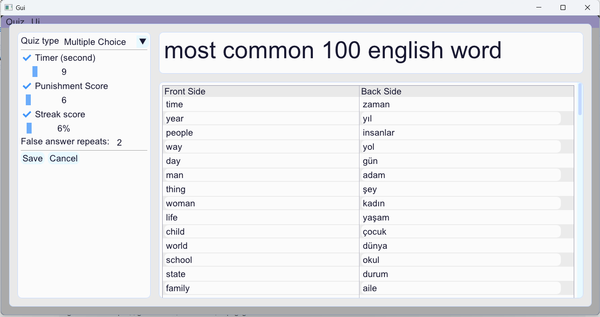
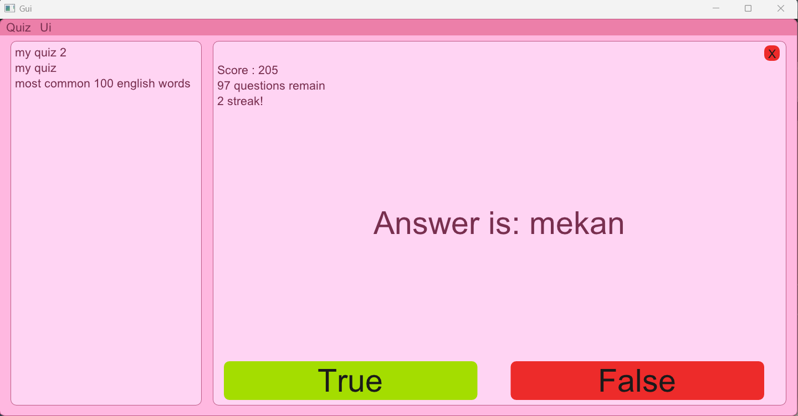
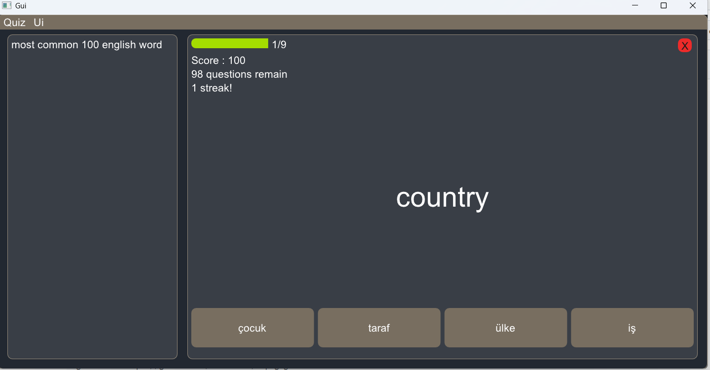

# Flashcard App

#### A flexible and powerful flashcard learning tool designed to help you master information through repetition, challenge, and customization. Switch between learning styles, and tailor the experience to your own pace.
## :heavy_check_mark:Fully Customizable Learning Experience
### Enable or disable features like:
  - :floppy_disk:**Fully Customizable Quizzes**
      - You can save, add, delete and edit your all quizzes.   
  - :x:**Wrong Answer Punishment**
      - Lose points and streak when answering incorrectly, optional and adjustable.
  - :hourglass:**Timer**
    - Set a countdown for each question
or turn it off entirely.
  - :fire:**Streak System**
      - Track consecutive correct answers to boost your score, or disable it if you prefer.
  - :repeat_one:**Repeat Incorrect Answers**
      - Configure how many times you'd like incorrect cards to repeat.
  - :rainbow:**Three diffrent theme**
      - :black_circle:Dark, :white_circle:Light and :heartpulse:Pink
## :left_right_arrow:Two Learning Modes
- :mag_right:**Classic Flashcard Mode** : Review and flip cards one by one.
- :o:**Multiple Choice Mode** : Answer randomly generated multiple-choice questions.
## :camera:Screenshots



## :computer:**Tech Stack**
- Language C++20
- GUI Framework: [Dear ImGui](https://github.com/ocornut/imgui.git) with backend of glfw_opengl3
- Build system Cmake (3.22)
- Package manager [vcpkg](https://github.com/microsoft/vcpkg.git)
- Compiler: GCC/MSVC/Clang
## :hammer:**Installation**     
```cmd
git clone git@github.com:Emre-Yesil/Flashcard_app_C-_Dear_ImGui.git
cd external
git clone https://github.com/Microsoft/vcpkg.git
.\vcpkg\bootstrap-vcpkg.bat # windows
./vcpkg/bootstrap-vcpkg.sh # Unix
```

## Credits
- Template and setup inspired by [franneck94](https://github.com/franneck94/UdemyCppGui.git)
